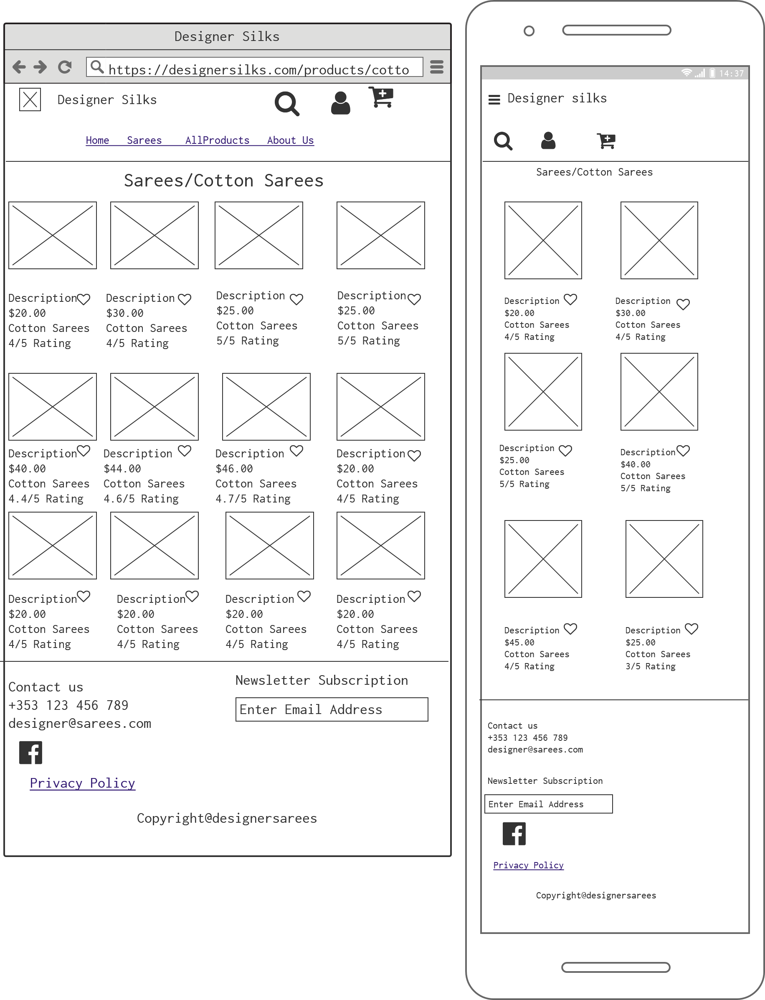
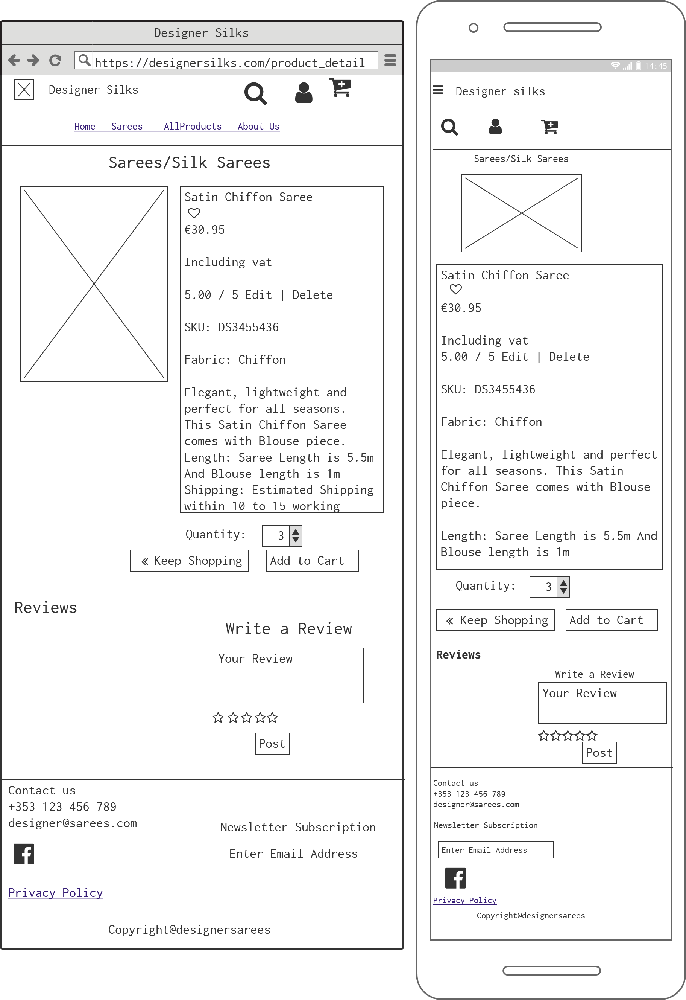
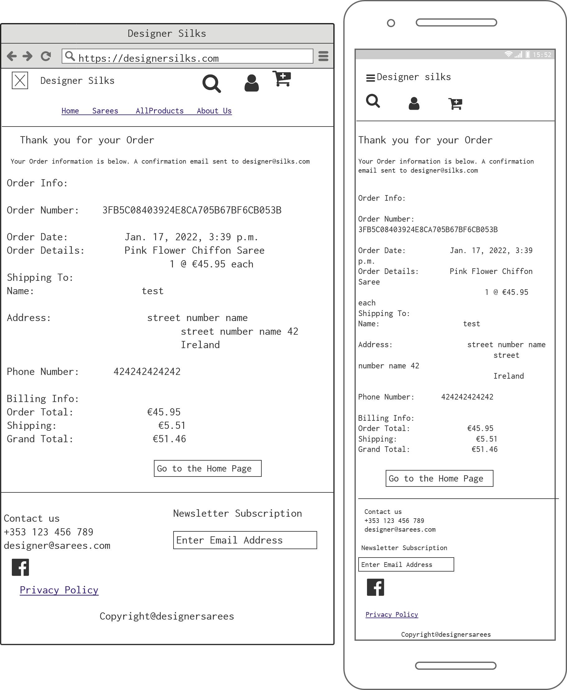

# DESIGNER SILKS

### Types of Content
- [Introduction](#introduction)
    - [Home](#home)
    - [Sarees](#sarees)
        - [Chiffon-Sarees](#chiffon-sarees)
        - [Cotton-Sarees](#cotton-sarees)
        - [Silk-Sarees](#silk-sarees)
        - [All-Sarees](#all-sarees)
    - [All-Products](#all-products)
        - [By-Price](#by-price)
        - [By-Rating](#by-rating)
        - [By-Category](#by-category)
        - [All-Products](#all-products)
    - [Contact](#contact)
    - [Search-bar](#search-bar)
    - [My-Account](#my-account)
        - [Register](#register)
        - [Login](#login)
        - [Logout](#logout)
        - [Product-Management](#product-management)
        - [My-Profile](#my-profile)
        - [My-Orders](#my-orders)
        - [My Wishlist](#my-wishlist)
    - [Cart](#cart)
    - [CheckOut](#checkout)
    - [Checkout-Success](#checkout-success)

- [Strategy](#strategy)
    - [UX](#ux)
    - [Business-Vision](#business-vision)
    - [Purpose of Website](#purpose-of-website)
- [Skeleton](#skeleton)
- [Scope](#scope "Goto Scope")
   - [Features](#features)
   - [Future Features](#future-features)
- [Structure](#structure "Goto Structure")
  - [Wireframes](#wireframes)
  - [Database Schema](#database-schema)
  - [Colours](#colours)
  - [Typography](#typography)
- [Technologies Used](#technologies-used)
- [Testing](#testing)
  - [Automation Testing](#automation-testing)
  - [Code Validation](#code-validation)
  - [Features Testing](#features-testing)
- [Bugs](#bugs)
- [Deployment](#deployment)
  - [Amazon Web Services](#amazon-web-services)
- [SEO](#seo)
- [Web Marketing](#web-marketing)
  - [Business Model](#business-model)
  - [Facebook](#facebook)
- [Email Marketing](#email-marketing)
- [General Data Protection Regulation-GDPR](#general-data-production-regulation-gdpr)
- [Acknowledgement](#acknowledgement)

## Introduction
- This project will cover Saree collections, which is one of the Indian Traditional Culture. 
- This webpage is categorised into Four main sections,such as Home, Sarees, All Products and Contact. In other two additional navigations available in the header, Which are My account and Cart.
- When the User choose Sarees Navigation option dropdown menu appears and shows four options to choose, such as Chiffon Sarees, Cotton Sarees, Silk Sarees and All Sarees.
- When the User choose All Products Navigation option, dropdown menu appears and shows four options to choose, such as By Price, By Rating, By Category and All Products.
- Finally Thanks message is displayed after submitting the Enquiry Contact form.
- when the User Choose My account Navigation option, dropdown menu appears and show Two options, such as Register and Login.
- Once the User Login in to  My Account option then the dropdown menu change to four different Categories, Such as My Profile, My Orders, My Wishlist and Logout.
- If the User is admin then an additional option is available which is Product Management. The Product Management option will allow the following options such as add the product, edit the product and delete the product.
- When the User Checkout from the Cart, it will move to Checkout Page. Success Message will appear Once the payment will be successfully completed.
- Success checkout message will appear in completion of the purchase Process.
- The website covers all the screen types, such as Pc,Laptop,Tablet and Mobile.

### Home
The Home Page covers the following sections:
- Header, Navigation Menus and Shipping details.
- Hero Image
- Shop Now button is available in the main page. Clicking this button move the user will go to Products Page.
- The Following options are availabele in the Footer:
  - Contact Details
  - Facebook Button
  - Privacy Policy
  - Newsletter subscription
- Header and Footer will appear in all pages through Navigations. 
- [ Home-ipad-1 ](static/images/home-ipad-1.PNG)
- [ Home-ipad-2 ](static/images/home-ipad-2.PNG)
- [ Home-ipad-3 ](static/images/home-ipad-3.PNG)

### Sarees
- When the User chooses Sarees Navigation option dropdown menu appears and shows four options to choose, such as:
#### Chiffon Sarees
- [ Chiffon Sarees -1 ](static/images/chiffon-sarees-1.PNG)
- [ Chiffon Sarees -2 ](static/images/chiffon-sarees-2.PNG)
- [ Chiffon Sarees Mobile -3 ](static/images/chiffon-sarees-3.PNG)
- [ Chiffon Sarees Mobile -4 ](static/images/chiffon-sarees-4.PNG)
#### Cotton Sarees
- [ Cotton Sarees -1 ](static/images/cotton-sarees-1.PNG)
- [ Cotton Sarees -2 ](static/images/cotton-sarees-2.PNG)

#### Silk Sarees
- [ Silk Sarees -1 ](static/images/silk-sarees-1.PNG)
- [ Silk Sarees -2 ](static/images/silk-sarees-2.PNG)
- [ Silk Sarees Ipod-3 ](static/images/silk-sarees-3.PNG)
#### All Sarees
- [ All Sarees Ipod-1 ](static/images/all-sarees-1.PNG)
- [ All Sarees Ipod Mini-2 ](static/images/all-sarees-2.PNG)
- [ All Sarees -3 ](static/images/all-sarees-3.PNG)
- Total number of Sarees available in each Sarees category is displayed for the User.
- Sorting Options are available for the User in each Sarees Category, Such as
  - Price (low to high) and Price (high to low)
    - [ Price (low to High) ](static/images/price-low-1.PNG)
    - [ Price (high to low) ](static/images/price-high-1.PNG)
  - Rating (low to high) and Rating (high to low)
    - [ Rating (low to High) ](static/images/rating-low-1.PNG)
    - [ Rating (high to low) ](static/images/rating-high-1.PNG)
  - Name (A-Z) and Name (Z-A)
    - [ Name (A to Z) ](static/images/name-atoz-1.PNG)
    - [ Name (Z to A) ](static/images/name-ztoa-1.PNG)
  - Category (A-Z) and Category (Z-A)
    - [ Category (A to Z) ](static/images/category-atoz-1.PNG)
    - [ Category (Z to A) ](static/images/category-ztoa-1.PNG)

### All Products
- When the User chooses All Products option dropdown menu appears and shows four options to choose, such as 
#### By Price
  - [ Sarees By Price ](static/images/by-price.PNG)
#### By Rating
  - [ Sarees By Rating ](static/images/by-rating.PNG)
#### By Category
  - [ Sarees By Category ](static/images/by-category.PNG)
#### All Products
  - [ All Products ](static/images/all-products.PNG)
- Total number of Sarees available in each Sarees category is displayed for the User.
- Sorting Options are available for the User in each Sarees Category, Such as
  - Price (low to high) and Price (high to low)
  - Rating (low to high) and Rating (high to low)
  - Name (A-Z) and Name (Z-A)
  - Category (A-Z) and Category (Z-A)

### Contact
- In the Contact form option, the user has to fillup all the parameters in the form. 
- There is a Newsletter option where the user has a choice to subscribe or not to subscribe the newsletter.
  - [ Contact Ipod-1](static/images/contact-ipod-1.PNG)
  - [ Contact Mobile-2](static/images/contact-mobile-2.PNG)

### Search bar
- The Search bar will help the user to narrow down the relevant products and display the products as per search description.
  - [ Search bar for windows ](static/images/search-bar-1.PNG)
  - [ Search bar for mobiles ](static/images/search-bar-mobile-2.PNG)

### My Account
  - [ My Account for Superuser ](static/images/my-account-1.PNG)
  - [ My Account Mobile view for Regular user  ](static/images/my-account-mobile-2.PNG)
- when the User Choose My account Navigation option, dropdown menu appears and show Two options, such as Register and Login.
- Once the User Login in to  My Account option then the dropdown menu change to four different Categories, Such as My Profile, My Orders, My Wishlist and Logout.
- If the User is admin then an additional option is available which is Product Management. The Product Management option will allow the following options such as add the product, edit the product and delete the product.
  
#### Register
- The User can use the Register option to fillup their information to register. 
  - [ Register Mobile View ](static/images/register-mobile.PNG) 
Registration page contains:
    - Header and Footer
    - Email
    - Email confirmation
    - Username (It is not case sensitive)
    - Password (It is not case sensitive)
    - Confirm password
    - Back to Login button
    - Signup button
  After Registration, mail will be send to the user to confirm for registration.
    
#### Login
- Only Registered User is able to use login option to login in to the website. 
- [ Login Mobile View ](static/images/signin-mobile.PNG) 
Login Page contains:
    - Header and Footer
    - Username
    - Password
    - Remember me with checkbox
    - Home Button
    - Sign in button
    - Forget Password? 
After Login, the success login message will appear on the rightside of the Page.

#### Logout
- The User should logout from the website after using the website.
  - [ Logout Mobile View ](static/images/signout-mobile.PNG)
 
Logout Page Contains:
    - Header and Footer
    - Cancel button
    - Sign out button
After Logout, the success logout message will appear on the rightside of the Page.
    

#### Product Management
- The Product Management option will allow the following options such as add the product, edit the product and delete the product for the admin.
  - [ Add Product Page Only for Admin ](static/images/add-product.PNG)
  - [ Edit Product Page Only for Admin ](static/images/edit-product.PNG)
#### My Profile
- Login user can update or store their Delivery information.
  - [ My Profile Mobile view ](static/images/my-profile-mobile.PNG)
#### My Orders
- Order history and information about the products will be stored in the database.
  - [ My Orders ](static/images/my-orders.PNG)
#### My Wishlist
- user can add favourite items into the wishlist and shortlist what to buy later.
- Delete Button
  - [ My Wishlist Ipod view ](static/images/my-wishlist.PNG)

### Product Details
- Product Details options contains: SKU (Product id),Fabric (Material Type), Description,length, Shipping and Returns.
- Quantity option is available for User to select the number of products of the same product.
- The cart will be update the section.
  - [ Product Detail -Ipod view ](static/images/product-detail-ipod-1.PNG)
- There is Review Section in Product Details Page. There are three buttons in Write a Review section in the product detail page. Such as Post, Edit and Delete buttons. Post buttons will only appear for any login users.If the user is not login they Cannot see the Post button and ask them to login in to the website. The Reviews can be Edit or Delete by the same user who has posted the message earlier.
  - [ Write a Review -Ipod view ](static/images/reviews-post.PNG)
  - [ Edit a Review -Mobile view ](static/images/review-edit.PNG)

### Cart
- Shopping Cart page contains:
  - Header and Footer
  - Product Image
  - Product Info
  - Price
  - Quantity 
  - Quantity Update and Remove Button
  - Subtotal
  - Cart Total
  - Shipping Cost
  - vat included in this Price
  - Grand Total
  - Free shipping Delta
  - Keep Shopping and Secure Checkout Button
      - [ Shopping Cart for Larger Screen](static/images/shopping-cart.PNG)
      - [ Shopping Cart for Mobile View](static/images/shopping-cart-mobile.PNG)

### Checkout
- Checkout Page contains:
  - Personal Details Such as Fullname and Email.
  - Shipping Address Such as Phone, Address line1, Address line2,County or City,Postcode and Country.
  - Payment Credit card details
  - Order Summary
    - Product Image
    - Product Info
    - SubTotal
    - Shipping Cost
    - Grand Total
  - Adjust Bag and Complete Order Button
  - [ Checkout Page for Larger Screen](static/images/checkout-windows.PNG)
  - [ Checkout Page for Mobile view](static/images/checkout-mobile.PNG)
  

### Checkout Success
- Checkout Success Page contains:
  - Thanks Message
  - Message for confirmation mail send to User
  - Order Info such as Order Number and Order Date
  - Order Details such as Product Info and Price
  - Shipping To column contains Name, Address and Phone Number
  - Billing Info such as Order Total, Shipping Cost and Grand Total
  - Go to the Home Page Button
  - [ Checkout Success](static/images/checkout-success-testing.PNG)

## Strategy
The website covers all the screen types, such as Pc, Laptop, Tablet and Mobile. The website is easily navigate to all the sections. This online Business designed for local and international market. The B2C business model is choosen to enhance the business growth and update product trend according to market sentiment. 
### UX

#### UserStory using Kanban feature in Agile Methodology
  These are the steps for UX 
1. Click Projects in the dosa palace repositary and Create a Project name.
2. Then select, Project Template => Basic Kanban => create Project.
3. In the ToDo column, there will be three cards, delete those cards.
4. In the Todo column click three dots, then click =>  manage automation => click newly added box => update automation.
5. Then click => issues => new issues => Get started.
6. Then start to write Title and UX. 

    - As a Site User I can view the service options available in the Designer Silks Home page so that I can select the service that is required.
    - As a Site User I can view a paginated Navbar so that easily view that page.
    - As a Site User I can View all the Sarees in the product page So that I know how many collections are there in the website.
     - As a Site User I can Click the Saree image So that I can View the details of the product.
     - As a Site User I can write and read a Review So that I should know about the product.
    - As a Site user I can view the product by price, rating, name and category so that I can easily find the products.
    - As a Shopper or User I can View a specific category of product So that I can quickly find the products by Category.
    - As a User or Shopper I can Search the name of the product So that I can easily find the product what I want.
    - As a Site User I can Register for an account So that I can Have a personal account and can able to view my Profile.
    - As a Site User I can Easily Login my account So that I can Access my personnal account information.
    - As a Site User I can Easily Logout so that I can Logout safely from the website.
    - As a Site Owner I can Edit or Update the Product details So that I can Change Products details such as name,price,description, images or any discount available of the Product.
    - As a Shop Owner I can Add a Product So that I can Add new products in the website.
    - As a Site Owner I can Delete a Product So that I can Delete the Product if there is not available.
    - As a Site User I can have my personal profile So that I can view my personal details, order details, order confirmation and Payment information.
    - As a Site User I can Receive a email confirmation from the shopper after checkout So that I can Confirm the product quantity and payment is done correctly.
    - As a Site User I can Adjust or Remove the product in the cart So that I can easily changes in my purchases before checkout page.
    - As a Site User or Shopper I can view my cart to be purchased So that I can view total cost and qunatity of my purchase.
    - As a Site user I can view the shopping cart So that I can view the item ordered in the cart.
    - As a Site User I can easily select quantity of a product So that I can decide how many quantity to buy.
    - As a Site User I can view on order confirmation So that I can view what purchase i made.
    - As a Site User I can easily enter my payment option So that there is no issues in the payment process.
    - As a Site User I can provide my personal and payment details are safe and secure So that I can trust the purchase Site.
    - As a User I can write a Review about the product So that It will help for others.
    - As a Site User I can add favourite Products in to the Wishlist So that I can decide what to buy during the purchase.
    - As a Site User I can Delete the products from the wishlist So that I can shortlist what to buy.
    - As a Site User I can use Contact form to send enquiry So that I can enquire information regarding products and services.
    - As a Site User I can subscribe option for Newsletter So that I can get the information regarding the products regularly.
    
    
### Business Vision
To create a truly global brand that provides growth opportunities for the company, whilst achieving its goal of becoming the number one value fashion retailer across the globe.
To become a globally prominent online retailer and be ranked amongst the top online retailer in the world in terms of quality, service standards and ultimately customer satisfaction.

### Purpose of Website
The Retail market is moving towards online retailing. This website is created to sell Indian Traditional sarees to global market via online. 

## Skeleton
There are approximately 34 products and 3 categories in the designer silks website.
## Scope
This website covers different types of Sarees, Product details, Shipping and return policyand  Reviews about the product. 
There is Wishlist option for the user to use. 
Secure Payment option is used for the User purchase the product. 
And Facebook page is used for Social Media Purposes. 
There are Newsletter subscription and Contact form options available in the website. 

### Features
- A page with an overview of all the products which can be sort by name, rating, price and category
- A contact form where customers can ask questions.
- Newsletter subscription for Further details.
- Social Media page for New updates.
- A Registration Page
- Login Page
- A page for when the customer forgot their password
- Logout page for after using the website
- viewing the order history page
- viewing the wishlist page
- A profile page to adjust the user's details.
- An order sytem, to order the products
- Secure Stripe Payment
- Reviews about the products.
- Shipping estimation days and Return policy
- privacy policy

### Future Features
- Other Variety of Products can be added in the website
- Childrens Indian Tradional costumes can be added.
- Designer clothings can be added
- Discount options can be used to widen our market Portfolio.

## Structure
The site will be structured as clear as possible, with a logic workflow and it should be easy to navigate the site on all screen sizes. This project is divided into four main pages. The website was better organised after my mentoring session with my mentor. The website was structured such a way that the users can navigate to find relevant information according to their need.
### Wireframes
Balsamiq Wireframes used for this website.

Home

Cotton Sarees

Silk Sarees

Product Details

Shopping Cart

Checkout

Checkout Success Message

Product Management

Register

Login

Logout

My Profiles

My Orders

My Wishlists

Contact Page

### Database Schema
db diagram used for this website.

DB Diagram

### Colours
I have used warm light and dark colours to create pleasant experience for those people to viewing this website. Bootstrap colour also used for this website.
colours used:
 - Bootstrap bg and text colours used throughout the project.
 - #000
 - #fff 
 - #222 
 - rgb(235, 29, 63)
 - #aab7c4
 - rgb(24, 136, 241)
 - #dc3545
 - rgb(208, 225, 247)
 - rgb(161, 204, 248)
 - rgb(170, 183, 196)
 - rgb(173, 227, 245)

### Typography
I have used Open Sans, cursive and 'Raleway', sans-serif to create this website.

## Technologies Used

### Libraries & Frameworks
- Django Web Application Framework
- Bootstrap - for responsive website
- Font Awesome - icons used throughout the webpages. Responsive design - To generate the mockup image.
- Google font -used for the website looks more beautiful,fast and great typography.
- stripe -for payment

#### Tools
- Gitpod - is an open source platform for automated and ready-to-code.
- Github - to save the project code and host the live project.
- Python Tutor - to check how the Java Script code behaves in each line.
- Dev tools -For inspecting and editing the web code.
- Heroku - To Deploy the Project.
- allauth - for site user Signup, login and logout of account.
- Cloudinary - To save images from admin page.
- favicon - https://www.favicon-generator.org/ -Favicon icon created using this website.
- Am I responsive - to check  the responsive pages.
- Balsamiq - to create wireframes.
- dbdiagram.io - to create database schema
- Random Secret Key Generator - https://miniwebtool.com/django-secret-key-generator/
- Amazon Web Servvices -to save media and static folder -https://aws.amazon.com/
- SEO  -https://www.xml-sitemaps.com/
- Privacy policy Generator -https://www.privacypolicygenerator.info/
- For images -https://pixabay.com/
- Testing Real Send Mail -https://temp-mail.org/

## Facebook
I create Facebook page for my Designer Silks Business.

## Testing
### Automation Testing
### Code Validation

### Features Testing
#### Home Page Testing
There are 25 testCases in Home Page. 
There are 20 testcases in  header section, which are Designer Silks, Home, Chiffon Sarees, Cotton Sarees, Silk Sarees, All Sarees, By Price, By Rating, By Category, All Products, Contact, search bar, Product Management, My Profile, My Orders, My Wishlist, Register, Login, Logout and Cart Navigation. 
Designer Silks heading and Home Navigation are designed to bring the user back to the home page.Testing also proves that these options worked as per design. The other navigations are designed to bring the user to the website.Testing proves that these options worked as per designs.
- [Header-Testing](static/images/home-testing.PNG)
- If the user enter any keyword in the search bar it will show the number of sarees available as per search.
  - [Search Box Testing](static/images/search-box-testing.PNG)
- If the search option used without any information in the search bar, it will give error message that Please enter the search criteria!. 
  - [Search Box Error message Testing](static/images/search-error-msg-testing.PNG)
 
- There is 1 Testcase in middle of the Hero image. If the user click the Shop Now Button it will navigate to Products Page. Testing proves that this option worked as per design.
- [Shop-Now-Button-Testing](static/images/home-testing-2.PNG)
 

- There are 3 Testcases in the Footer Page.
  1. There is one Social media Facebook link attached in all other pages.When click the Facebook button it brings to the Facebook page.
  2. Privacy Policy for Designer Silks.
  3. Newsletter Subscription (optional) connected to Mailchimp.
All the three testcases worked as per design requirements.
- [Footer-Testing](static/images/home-footer.PNG)
#### All Products page Testing
There are 5 testcases in Chiffon Sarees, Cotton Sarees, Silk Sarees, All Sarees, By Price, By Rating, By Category and All Products Page. There are two testcases for wishlist. Which covers add or Remove items into the Wishlist.These options are only available for Registed User. If the user is not logged in, it will provide a tooltip  to remind the user to login. And there are two buttons for Edit and Delete the products for Admin. If the Normal User clicks these buttons it shows a message that Sorry, Only store owners can do that. When the user clicks any products image it will redirect to individual product detail page. Testing proves that these options worked as per design. 
- [Product-Page_Testing](static/images/product-page-testing.PNG)
- There is a Sort by table for user to find the easiest way to go the product search.Testing Proved that these option worked as per design
  - Price(low to high)
  - Price(high to low)
  - Rating(low to high)
  - Rating (high to low)
  - Name(A to Z)
  - Name(Z to A)
  - Category(A to Z)
  - Category(Z to A)
  - [Sort By Table Testing](static/images/sort-by-testing.PNG)

- [Error Message-When the normal user clicks Edit/Delete Button ](static/images/error-msg-testing.PNG)
- [Success Added Wishlist Message ](static/images/add-wishlist-testing.PNG)
- [Removed from Wishlist Message](static/images/remove-wishlist-testing.PNG)

#### Product_details Page Testing
- There are 7 new testcases in Product detail page such as Quantity increase and decrease button,Keep shopping button, Add to cart button, Proceed to cheekout button and Reviews Post, Edit and Delete button for login User. It also provides success and alert messages will display on top of the page. Testing proves that these options, success message and alert messages are worked as per design. 
  - Quantity increase and  decrease button can add 1 to 99 products. User cannot used  letters or decimal points in that box. 
  - Keep shopping button goes to Product page. Testing proves that this option worked as per design.
    - [Quantity Increment, Decrement button and Keep Shopping Button](static/images/quantity_shopping_testing.PNG)
  - When I click Add to Cart button, shopping cart details toast message will appear.  There is one testcase for Proceed to checkout button. If the user clicks Proceed to checkout button, it will move Shopping Cart page. Testing proves that these options worked as per design.
    - [Add to Cart button and Proceed to checkout button](static/images/add-to-cart-testing.PNG)
  - There are three buttons in Write a Review section in the product detail page. Such as Post, Edit and Delete buttons. Post buttons will only appear for any login users.If the user is not login they Cannot see the Post button and ask them to login in to the website. The Reviews can be Edit or Delete by the same user who has posted the message earlier.
    - [Post, Edit and Delete Buttons in the Review section ](static/images/post-edit-delete-testing.PNG)
    - During the Review Post the login user must fill both comment and Rating, otherwise error message will appear.
      - [ Write a Review Form Validation](static/images/review-validation1-testing.PNG)
      - [ Error Message for not entering Review Rating ](static/images/review-rate-validation-testing.PNG)
    - Once the user published the Review Post, the success message will appear.
      - [ Success Message for Add Reviews ](static/images/review-success-msg-testing.PNG)
    - Edit the Post -After Editing the Post, successfully updated message will appear.
      - [ Success Message for Update Reviews ](static/images/review-success-update-msg.PNG)
    - Delete the Post - After the post has been Deleted, Alert Deleted message will appear.
      - [ Success Alert Message for Deleted Reviews ](static/images/review-delete-msg-testing.PNG)

- And There are 5 testcases similar like All Products page(such as Wishlist add, remove button and Please login tooltip and Edit/Delete the product page.)

#### Cart Page Testing
- There are 4 Testcases in Cart page. Such as Update, Remove, Keep Shopping and Secure Checkout Buttons.
1. Update Button - User can update the quantity increase or decrease items and followed by clicking the update button it will update the quantiy and automatically correct the amount of subtotal according to the quantity selected. The item quantity can range between 0 to 99. the programme donot allow letters and decimal points. Success message will appear after updating the quantity. Testing Proved.
  - [ Success Message for Updated the Product quantity ](static/images/update-qty-testing.PNG)
2. Remove Button - The remove button can be used to delete items in the shopping Cart page. The new page opens and remainds the user the shopping cart is empty and success message will appear on the top right.There is one button for Return to shop. If the user Press that Button it will redirect to Products page.Testing Proved.
  - [ Product Removed from the Cart message ](static/images/delete-qty-testing.PNG)
3. Keep Shopping - User click the Keep shopping button it will redirect to Product page. Testing Proved.
4. Secure checkout Button - User clicks this button it will go to Check out page. Testing Proved.
  - [ Keep Shopping and Secure Checkout Button ](static/images/secure-checkout-testing.PNG)

#### Checout Page Testing
There are Two Testcases in the Check out page. such as Adjust Bag and Complete order Button. And Required form validation Tested in this page. if the User is not login, then it will ask you to Register or Login the page.  Testing proves that these options worked as per design. 
  - Adjust Bag button - It will Redirect to Cart Page if the user want to update or remove the product.Testing Proved.
    - [ Adjust Bag Button ](static/images/adjust-bag-testing.PNG)
  - Complete Order Button - It will goes to Checkout Success Page if they enter all the required Criteria fields.Testing Proved.
  Two Credit Card Details will approve this payment:
    - 4242 4242 4242 4242
    - 4000 0025 0000 3155
    -  [ Complete Order Button ](static/images/adjust-bag-testing.PNG)
    -  [ Register or Login button if they are not Login for Purchase ](static/images/checkout-login-testing.PNG)

  - Forms Validation in the Checkout page
    - [ Validation for Name Field ](static/images/name-field-testing.PNG)
    - Email Field Automatically stored from Login user
    - [ Validation for Email Field ](static/images/phone-field-testing.PNG)
    - [ Validation for Phone Field ](static/images/phone-field-testing.PNG)
    - [ Validation for Address Line1 ](static/images/street-name-testing.PNG)
    - Address Line 2 (street name optional) is a optional one. So there is no validation for this.
    - [ Validation for County or City ](static/images/county-field-testing.PNG)
    - Postcode is a optional one. So there is no validation for this.
    - [ Validation for Country ](static/images/country-field-testing.PNG)
    - [ Validation for Credit Card ](static/images/card-field-testing.PNG)
      - Two Credit Card Details will approve this payment:
      - 4242 4242 4242 4242
      - 4000 0025 0000 3155
    - [ Validation for Incorrect Credit Card ](static/images/incorrect-card-testing.PNG)
    - [ Validation for Incomplete Credit Card ](static/images/incomplete-card-testing.PNG)
    - Once the User entered their shipping address and if they click Save the information to my Profile, it will stored in the Profile page. For next Purchase, they dont need to enter the shipping details again. if they want to send the product  to another address then they can edit the address in the checkout page. Testing proves.
    - [ Validation for Save the Information to the Profile Page Checkbox ](static/images/save-info-testing.PNG)
  - If they unclick the Save information when the purchase order done, then it wont stored in the Profile page. Testing Proved.
    - [ Validation for Unclick the checkbox for Save the Information to the Profile](static/images/unclick-checkbox-testing.PNG)

#### Checkout Success Page Testing
There is one Testcase in the checkout success page which is Go to the HomePage. It will redirect to home page. Testing Proved.
  - [ Go to the Home Page button](static/images/checkout-success-testing.PNG)

#### Contact Page Testing
  - There is one Testcase in the Contact page which is Send button. Once the user used the contact page then thanks for contact us message will appear. They have option to choose whether newsletter subsription need or not. Form validation checked for contact page. All the Testing options are proved.
    -  [Contact us success message ](static/images/contact-success-msg-testing.PNG)
    - Contact Form Validation
      - [ Name field Validation](static/images/contact-name-testing.PNG)
      - [ Email field Validation](static/images/contact-email-testing.PNG)
      - [ Subject field Validation](static/images/contact-subject-testing.PNG)
      - [ Newsletter Radio box Validation](static/images/newsletter-testing.PNG)
  #### Product Management Page Testing
  Only the Super User is allowed to access the Product Management page. The page allows the following,Add, Edit and Delete the product from the website.
  - Add a Product
    - There is 2 test Cases in the Add a product page. Such as Cancel and Add Product Button. If we click Cancel button it will redirect to products page. If we click Add product button, the product will stored in the products page. Testing Proved.
      - [ Add a Product page Testing](static/images/add-product-testing.PNG)
    - Form Validation for Add product table.
    In the Form, Category field can choose from three categories. The other required fields are Name, Price and Description. SKU, Rating, Material and Length fields are Optional. if the superuser is not selected Image Field No image found picture automatically stored in the new product detail page.Finally success message will appear in the new product detail page. All the Testing options are proved.
      - [ Name Validation in Add Product](static/images/add-product-name-testing.PNG)
      - [ Price Validation in Add Product](static/images/add-product-price-testing.PNG)
      - [ Description Validation in Add Product](static/images/add-product-des-testing.PNG)
      - [ New Product detail -if image is not selected in the Add product](static/images/add-product-success-msg-testing.PNG)

  - Edit Product
    -  There is 1 new testcase in the Edit product page which is Update Product.If the superuser click edit button in the product or product detail page, it will allow the user to edit the details and alert message will appear for before editing the product. After Updating, success update message will appear. Testing proved.
      - [ Update Button in the Edit product page](static/images/edit-product-testing.PNG)
      - [ Alert message for before Editing the Product](static/images/edit-product-msg-testing.PNG)
      - [ Success message after Updating the Product](static/images/edit-product-success-msg-testing.PNG)

  - Delete Product
    - If the superuser click Delete button the product will be deleted, and then successfully deleted message will appear on top of the page. Testing Proved.
    - [ Success message after Delete the Product](static/images/delete-product-testing.PNG)

  #### My Profile Page Testing
  - There is 1 testcase in the Profile Page which is Update Information Button. After updating the Profile details success message will appear. Testing Proved.
    - [ Update Information Button in the Profile Page](static/images/profile-page-testing.PNG)
    - [ Success message after updating the profile page](static/images/profile-success-msg-testing.PNG)

  #### My Order Page Testing
  - There is one test case in My Order page, Which is order number. Login User's all the orders are stored in this page. When the user clicks Order number it will redirect to checout success message page.Testing Proved.
      - [ My Order Page Testing](static/images/my-orders-testing.PNG)
  
  #### My Wishlist Page Testing
  - There is one TestCase in My Whislist Page, Which is Delete Button. Login User can Delete the wishlist item from Wishlish page. After Deleting Wishlist, Removed alert message will appear on top of the page. Testing proved.
    - [ My Wishlist Page Delete Button Testing](static/images/my-wishlist-testing.PNG)
    - [ Removed alert message after Deleted a wishlist](static/images/my-wishlist-delete-msg-testing.PNG)

  #### Register Page Testing
  - There are 3 TestCases in Register Page, such as Sign in, Back to Login and Sign Up button. If the User click either signin or Back to Login button, it will redirect to Login Page. This login page for Existing customer. If the User is new they have to Register the page for add or remove wishlist, Reviews about the product or Checkout Payment page. All the Testing options are proved.
    - [ Sign Up page ](static/images/signup-testing.PNG)
    - Form Validation for signup Page
      - [ Validation for Email Field ](static/images/signup-email-field-testing.PNG)
      - [ Validation for confirm Email Field ](static/images/signup-confirm-email-field-testing.PNG)
      - [ Validation for Username Field ](static/images/signup-username-field-testing.PNG)
      - [ Validation for Password Field ](static/images/signup-password-field-testing.PNG)
      - [ Validation for Confirm Password Field ](static/images/signup-confirm-password-testing.PNG)
    - After clicking the Sign up page, then the new page opens and remainds the user that Verify your Email Address and alert message will appear on the top right. Testing proved.
    - [ Verify Email Address and Message Sent to User's Email Address ](static/images/signup-alert-msg-testing.PNG)
    - Then the User received mail, they have to click the link to confirm for Registration.
    - [ Confirm for Registration ](static/images/signup-confirm-email-testing.PNG)
    - Once the user click the confirm button, then confirm success message will appear.
    - [ Success message for confirm Registration ](static/images/signup-success-msg-testing.PNG)   

  #### SigIn Page Testing
  - There are 4 Testcases in signin page.such as Signup, Home, Signin and Forget Password? Buttons. If the user is not existing customer, they have to Signup(Register) first. So if the user clicks Signup page, it will redirect into Register Page. If the User clicks Home button, it will redirect into Home page. If the User clicks Sign up page, they need to enter either username or email and password for signing in. If they want they can click remember me button for easiest way to go this site everytime, this is optional. Finally there is button called Forget Password? button if they forget the password. User needs to click this button and enter their registered email, then mail will send to their email address. They can click that link to enter the New password. All the Testing options are proved.
    - [ Sign In page ](static/images/signin-testing.PNG)
    - Form Validation for Signin Page
      - [ Must enter Username or email for SignIn ](static/images/signin-username-field-testing.PNG)
      - [ Must enter Password for SignIn ](static/images/signin-password-field-testing.PNG)
    - if they click forget passwod button, new page will open for Password Reset. Testing proved.
      - [Password Reset button  ](static/images/signin-forget-password-testing.PNG)
    - Then they enter their registered email, and click the Reset My Password button. Next the message says that mail send for Password Reset. Testing proved.
      - [Mail send for Password Reset button  ](static/images/signin-password-reset-mail-testing.PNG)
    - Then they click the link from mail, it will goes tp Change Password page. They have to enter new password in the two columns and needs to click to Change password button. Testing proved.
      - [ Change Password ](static/images/signin-change-password-testing.PNG)
    - Finally success message will appear for change password. Testing proved.
      - [ success message for Change Password  ](static/images/signin-success-msg-testing.PNG)
    - Now the user can login with username and password. Once they logged in, success message will appear on the top of the page.Testing proved.
      - [ Success message for Signin](static/images/signin-success-testing.PNG)

  #### Signout Page Testing
  - There are two Testcases in Signout page, such as Cancel and Signout button. If the Login user clicks Cancel Button, it will redirect into Home page. If the login user clicks Signout Button, success message will appear for Signout. All the Testing options are proved.
    - [ Sign out page ](static/images/signout-testing.PNG)
    - [ Success message for Signout](static/images/signout-success-msg-testing.PNG)

## Bugs
1. I try to create new app for wishlist and reviews and add into the products page and product_detail page. But i donot know how to connect these apps to product app. Then i decided to add new models for wishlist and Review in the product app and connect the data into the products templates. Within limited time period i couldnot able to do that, but after this course sure i will learn it.
2. When I complete the payment system i received duplicate order number in the order history and admin page. I resolved this problem with Tutor support.
3. When I do the Real send mail section i didnot received a confirmation message in my email. This problem also resolved with Tutor Support.

## Deployment
First we need to go to github website to create a new repositary using code Institute Template. Followed by giving a new name of the website.Then need to click the create repositary button. After click the button it will bring us to go to another page, which contains the green button labelled as Gitpod.Click the Gitpod button will bring us to the Gitpod Workspace for coding screen.

### gitpod
  Used Gitpod Workspace for coding. To preview the browser window need to type <b>python3 manage.py runserver</b> in the terminal window at the bottom.Afterthat, have to do git add for add files or remove files and do git commit for reasoning and do the git push for git hub repositary website.
### Procedure for Deployment

  1. Install the Django and gunicorn in the terminal => pip3 install django gunicorn (Gunicon is the server that we're going to use to run Django on Heroku.) 
    next install supporting libraries:
  2. Then Install ==> pip3 install dj_database_url psycopg2
  3. Create Requirement.txt file in the terminal. 
       ==> pip3 freeze --local > requirements.txt
  4. Create a new project name: 
    ==>django-admin startproject designer_silks .
  5. Create a new apps  in the designer-silks project: 
      - python3 manage.py startapp home
      - python3 manage.py startapp product
      -  python3 manage.py startapp cart
      - python3 manage.py startapp checkout
      -  python3 manage.py startapp profile
      -  python3 manage.py startapp contact

    Then enter the app name("home","product", "cart", "checout", "profile", "contact") in to the INSTALLED_APPS in settings.py
  Set up your database by running the following command in your terminal: 
    ==> python3 manage.py makemigrations 
    ==> python3 manage.py migrate 
    Then run the server: 
    python3 manage.py runserver (we can see the installation work successfully in the browser). 
    6. Now create a superuser to get access to the Django admin, use the following command: 
     ==>python3 manage.py createsuperuser. 
  7. Allauth Setup 
     Install ==> pip3 install django-allauth==0.41.0 
    Add the allauth folder in to root templates. 
  8. mkdir static folder (for css,js,images and wireframes folder) 
       mkdir media folder (for products images) 
  9. Now we need to add the required fixtures data into the database in the following order by using the following commands: 
      ==> python3 manage.py loaddata categories 
      ==> python3 manage.py loaddata products. 
  10. Run in the terminal ==>mkdir/templates/includes 
  - toast (for using successful, error, warning and info messages throughout the webpage)
  - footer.html
  - main-nav.html
  - mobile-top-header.html
  11. In cart app needs to create contexts.py file. 
  IN SETTINGS.PY last line under MEDIA_ROOT
  - FREE_SHIPPING_THRESHOLD = 80
  - STANDARD_SHIPPING_PERCENTAGE = 12
  12. for caluculating the price and howmany quantity
      create new folder in the cart app  
      - templatetags(inside the templatetags folder) create 2 files  
        -  __init__.py
        - bag_tools.py
  13. For checkout app: 
    - pip3 install django-crispy-forms
    - settings.py => INSTALLED_APPS ==> #other apps
                                      'crispy_forms' 
    - under ROOT_URLCONF ==>   CRISPY_TEMPLATE_PACK = 'bootstrap4'
    - OPTIONS  ==>   'builtins': [
                'crispy_forms.templatetags.crispy_forms_tags',
                'crispy_forms.templatetags.crispy_forms_field',
    - In the terminal  ==> pip3 freeze > requirements.txt
  14. For Media file working
     - in settings.py ==> OPTIONS( below 'django.contrib.messages.context_processors.messages',) ==> 'django.template.context_processors.media',.

#### Stripe payment
1. in the base template add script tag for stripe   
2. in the checkout.html  
     
    {{ block.super }} 
    {{ stripe_public_keyjson_script:"id_stripe_public_key" }} 
    {{ client_secret|json_script:"id_client_secret" }}


  3. pip3 install stripe
  4. in settings.py ==> # Stripe 
    FREE_SHIPPING_THRESHOLD = 80 
    STANDARD_SHIPPING_PERCENTAGE = 12 
    STRIPE_CURRENCY = 'eur' 
    STRIPE_PUBLIC_KEY = os.getenv('STRIPE_PUBLIC_KEY', '') 
    STRIPE_SECRET_KEY = os.getenv('STRIPE_SECRET_KEY', '')

  5. in the terminal ==> export STRIPE_PUBLIC_KEY and export STRIPE_SECRET_KEY

  6. Create webhook.py
  7. Create webhook_handler.py
  8. In the stripe website ==> Goto Developer then go to webhooks and Add an endpoint for https://designer-silks.herokuapp.com/checkout/wh/

 

#### Heroku

    1. Create new app name and select europe.
    Then Click => Resources Tab => Addons enter=> Postgres, then select => Heroku postgres => Hobby dev.
    Then select the settings tab, click Reveal Config Vars and then copy the Database Value.
    2. And Add some more key values in the Heroku settings

      - SECRET_KEY	          -your_SECRET_KEY
      - STRIPE_PUBLIC_KEY	    -your_STRIPE_PUBLIC_KEY
      - STRIPE_SECRET_KEY	    -your_STRIPE_SECRET_KEY
      - AWS_ACCESS_KEY_ID     -from AWS
      - AWS_SECRET_ACCESS_KEY -from AWS
      - EMAIL_HOST_PASS       -from Gmail
      - EMAIL_HOST_USER       -Gmail
      - SECRET_KEY            -Random Key Generator
      - USE_AWS
#### In the Terminal
- Add Procfile and run requirements comment
- Then connect the heroku login in the terminal  
heroku login -i(enter username and password)  
- python3 manage.py createsuperuser(enter same username, email and password for admin page)
- git add, git commit and git push for heroku main.
- then again go to Heroku Deploy tab connect the github and click deploy for automatic Deployment or manual Deployment.

## Amazon Web Services 
https://aws.amazon.com/ 
- Register in AWS website
1. AWS Management Console, in the search menu ==> type s3 and select Scalable storage in the cloud
  - click ==> create Bucket
  -  bucket name ==> designer-silks
  -  region  ==> AWS Ireland
  -  remove blue tick from ==> Block all public access
  -  tick ==> i acknowledge
  -  then click ==> create bucket
  - then click the bucket name ==> designer-silks
2. Then click ==> properties tab 
    - click edit button in ==> static website hosting ==> click Enable button
    - then index document ==> index.html, error document ==> error.html then click ==> save

3.  Then go to Permission tab (3 changes)

    - cors configuration
			  
			  edit the button for cors configuration and paste the following  ==> 
            [
			{
				"AllowedHeaders": [
				"Authorization"
				  ],
				  "AllowedMethods": [
					  "GET"
				  ],
				  "AllowedOrigins": [
					  "*"
				  ],
				  "ExposeHeaders": []
			  }
			]
			
		- Bucket Policy
			
			- click edit button ==> click policy generator ==> new window will open ==> policy type click: s3 bucket policy ==> principle : * ==> Action: GetObject
			==> copy the ARN number from Bucket Policy and paste ARN : arn:aws:s3:::designer-silks   ==> click: Add Statement  ==> click: Generate Policy
			
			==>then copy the code and paste in Bucket policy box (then add  /* next to designer-silks/* because need to allow access to all resources in this bucket.)
			==> then save
			
			- Access control list (ACL)
			==>click: edit button ==> click Everyone (public access) ==> list (only)
			
4. then click ==> IAM (in the search box)
   - click ==> User groups (left hand side)  ==> create new group ==> name: manage-designer-silks ==> click create group
   - click ==> policies(left hand side) ==> create new policy ==> click JSON ==> click: Import managed policy (right hand side) ==> search box enter: s3 ==> click Amazon s3 Full access
      ==> then click; Import.
	  ==> copy the ARN number from  s3 Bucket policy and paste in JSON code Resources like this 
	  ==> "Resource": [
                "arn:aws:s3:::designer-silks",
                "arn:aws:s3:::designer-silks/*"
            ]  ==> then click: Review Policy ==> name: designer-silks-policy  ==> Description: Access to S3 bucket for Designer Silks static files
			==> then click: create policy
	5.  then again goto User groups ==> click: manage-designer-silks ==> goto: permission ==> click: Add permissions ==> then click: Attach policies
	   ==> then search designer-silks-policy ==> click: Attach policy
	   
	6.  then click ==> Users (left hand side) ==> Add Users ==>name: designer-silks-staticfiles-user ==> click: programmatic access ==>next permission
	   ==>click: manage-boutique-ado ==> just click: next tag ==>just click: next review ==>just click: create user ==> Download Csv (Save it properly cannot take it again).

  7. Then again in the workspace terminal:
    - pip3 install boto3
    - pip3 install django-storages
    - pip3 freeze > requirements.txt
    - then in settings.py enter ==> settings.py INSTALLED APPS ==> OTHER APPS(below crispy form) ==>'storages',
    - under the MEDIA URL
       - if 'USE_AWS' in os.environ:
       - then add: 
      Cache control, Bucket Config, Static and media files, Override static and media URLs in production.
      - check the heroku settings  
        - AWS_ACCESS_KEY_ID, AWS_SECRET_ACCESS_KEY, USE_AWS.
  - then create new file in the root ==> custom_storages.py 
    from django.conf import settings 
    from storages.backends.s3boto3 import S3Boto3Storage 

class StaticStorage(S3Boto3Storage): 
    location = settings.STATICFILES_LOCATION 

class MediaStorage(S3Boto3Storage): 
    location = settings.MEDIAFILES_LOCATION 
    Then do git push.
8. Media files in S3
  - Then again goto amazon s3 ==> designer-silks ==> create folder ==> name: media ==> save it 
  - then upload file all the images (control+shift) ==> permission Grant public-read access ==> then confirm ==> then upload.

### Sending Real Mails

- connect the gmail for sending mails.
- go to gmail account ==> settings ==> see all settings ==> accounts and Import ==> other Google account settings ==> security tab ==> 2 step verification
   ==> Get started ==> password then enter ==> click show more options ==> text message ==> enter 6 digit no from phone ==> turn on 
- then again goto ==> Security ==> App password ==> select app: mail ==> select device: other ==> then write: Django ==> click: generate ==> copy the app password
- Then go to Heroku SETTINGS enter  ==>    EMAIL_HOST_PASS, EMAIL_HOST_USER 
4. in settings.py
at the end ==>
if 'DEVELOPMENT' in os.environ:
    EMAIL_BACKEND = 'django.core.mail.backends.console.EmailBackend'
    DEFAULT_FROM_EMAIL = 'kavithasanthanesh2021@gmail.com'
else:
    EMAIL_BACKEND = 'django.core.mail.backends.smtp.EmailBackend'
    EMAIL_USE_TLS = True
    EMAIL_PORT = 587
    EMAIL_HOST = 'smtp.gmail.com'
    EMAIL_HOST_USER = os.environ.get('EMAIL_HOST_USER')
    EMAIL_HOST_PASSWORD = os.environ.get('EMAIL_HOST_PASS')
    DEFAULT_FROM_EMAIL = os.environ.get('EMAIL_HOST_USER')
  - git add . ==> git commit -m "sending real emails"

  - to check the email ==> temp email.com ==> copy the email address ==> register in the app using temp email.==> we can receive emails to temp email page. if we click that
    there is a url for confirm the verification ==> copy the url and paste in the browser and confirm it. then again sign in for the app.

  
## SEO

https://www.xml-sitemaps.com/
- Enter Heroku URL to create a sitemap
- Download you XML SITEMAP
- Then create sitemap.xml in the gitpod workspace and paste XML SITEMAP
- Then Create robots.txt, inside it enter the following details:
  - User-agent: *
  - Disallow: /accounts/
  - Disallow: /cart/
  - Sitemap: https://designer-silks.herokuapp.com//sitemap.xml
- Then add the meta tag in the base template head. Some inportant keywords for user. 

## Web Marketing
### Business Model(B2C)
- This business is designed for Business to Consumer model(B2C). B2C model is very suitable for such retail online Market. This model keeps the overhead cost low and very flexible to changes with market trend. B2C business model allows to capture global market and enhances growth to Business.
### Facebook account
I Created Facebook page for this website. I have attached the screen shot for the information:

## Email Marketing
### MailChimp- Newsletter Subscription
- Register for MailChimp account for designer silks email address. And create Signup embeded form, and take only Newsletter column for user newsletter subscription.

## General Data Protection Regulation-GDPR
### Privacy policy Generator
https://www.privacypolicygenerator.info/ 
- Enter Company Name, website name, Herokku Url followed by Country,State and email then click generate private policy. Copy the link clipboard and Paste in the base template footer.

## Final deployment:

After finish the project then need to do the following steps:

  - Debug= False in settings.py
  - git add . git commit -m "deployment commit" git push
  - Then Deploy and can view the App in Heroku.

## Acknowledgement
  - I would like to thank my mentor Rohit Sharma and my tutors Kasia for their helpfulness, constructive feedback and guidance when needed.
  - I would like to thank the staff, all the tutor supporters, students and my peers of Code Institute for their help.
  -I also like to thank Slack Community for sharing the open discussion from various students.
  - I search lots of information from Google, W3 School and Youtube for this project.
  - I follow the base structure in Boutique ado walkthrough. It will help me a lot for this project.
  - The images on this site have been taken from https://pixabay.com/, and used only for education purpose to complete this project.
  - Thanks for reading my README.md file.

